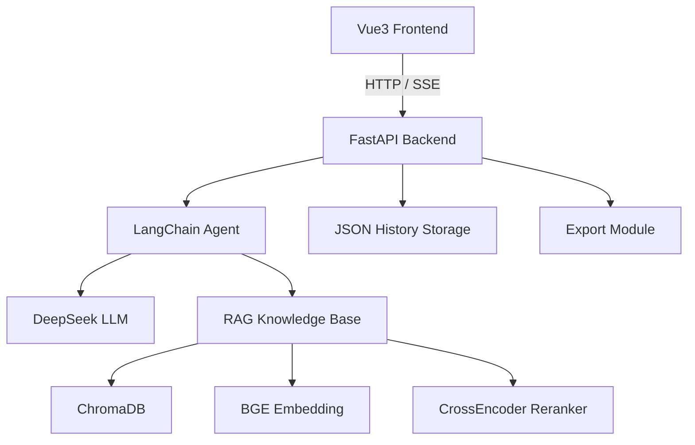
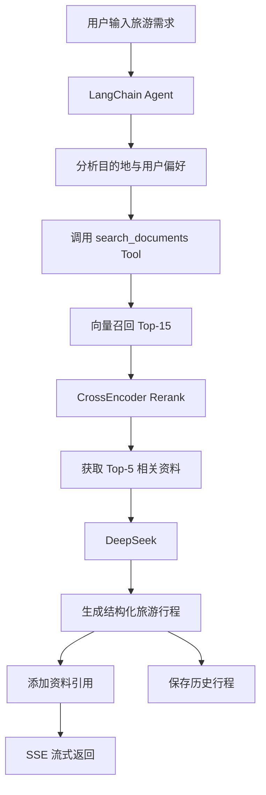
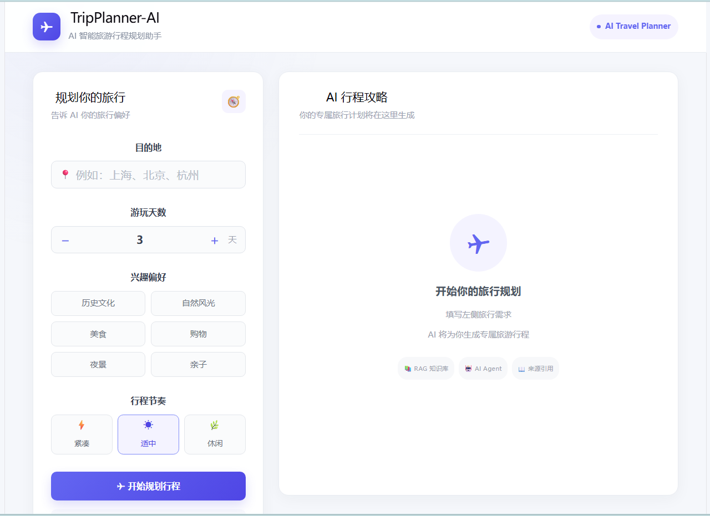
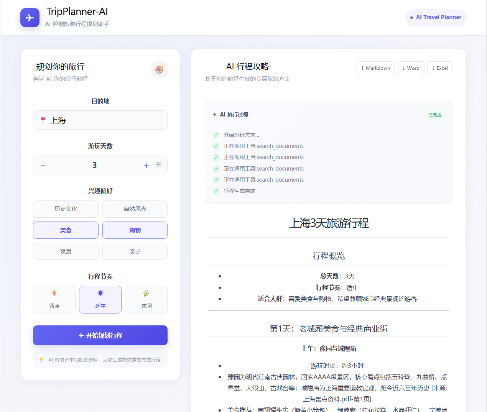

# TripPlanner-AI

智能旅游行程规划 Agent(仍在开发中...)


> 一个基于 **LangChain Agent + RAG + DeepSeek** 的智能旅游行程规划系统。
>
> 用户上传目的地旅游资料，并输入游玩天数、兴趣偏好和行程节奏，Agent 会自主调用本地知识库检索相关旅游信息，结合用户需求生成结构化旅游行程，并通过 SSE 实时流式展示生成过程。

---

# 🌟 项目介绍

TripPlanner-AI 面向个性化旅游行程规划场景，结合 **RAG 检索增强生成、LangChain Agent 和 DeepSeek 大语言模型**，实现从旅游资料上传、知识库构建到个性化行程生成的完整流程。

系统通过本地旅游资料构建知识库，在用户提出旅游需求后进行语义检索，并使用 Reranker 对召回结果进行二次排序，将高相关资料提供给 Agent，辅助生成旅游行程。

同时，系统保留旅游资料的文件名、页码等来源信息，为生成结果提供资料引用，并对知识库无法确认的信息进行明确提示，减少模型生成旅游信息时产生的幻觉。

---

# 🌟 项目亮点

* 基于 **LangChain Agent** 架构实现自主工具调用，根据用户旅游需求调用本地知识库工具
* 引入 **RAG 检索增强生成**，将目的地旅游资料进行解析、分片、向量化和语义检索
* 使用 **BGE Embedding + ChromaDB** 构建本地旅游知识库
* 使用 **CrossEncoder Reranker** 对向量召回结果进行二次语义排序，提高检索相关性
* 文档分片过程中保留 **文件名、页码等元数据**，支持旅游行程中的资料引用
* 通过 Prompt 约束 Agent 基于知识库资料生成行程，减少景点、路线等信息的虚构
* 对知识库中无法确认的信息进行明确提示，避免模型直接编造旅游信息
* 基于 **SSE** 实现 Agent 工具调用状态和行程内容的实时流式输出
* 使用 **Vue3 + FastAPI** 实现前后端分离架构
* 支持历史旅游行程保存、查询以及 Markdown / Word / Excel 导出

---

# ✨ 功能特性

## 🤖 Agent 智能行程规划

用户输入旅游需求：

```text
目的地：上海
游玩天数：3天
兴趣偏好：历史文化、城市观光、美食
行程节奏：适中
```

Agent 根据用户需求自主调用知识库工具，并生成多日旅游行程。

核心流程：

```text
用户输入旅游需求
        ↓
    LangChain Agent
        ↓
调用知识库 Tool
        ↓
     RAG 检索
        ↓
获取相关旅游资料
        ↓
      DeepSeek
        ↓
生成旅游行程
```

---

## 📚 RAG 旅游知识库

系统支持上传：

* PDF
* Word
* TXT

上传旅游资料后自动完成：

```text
旅游资料上传
     ↓
   文档解析
     ↓
   文档分片
     ↓
Embedding向量化
     ↓
ChromaDB存储
     ↓
语义检索
     ↓
辅助Agent生成行程
```

文档处理过程中保留原始资料的文件名、页码等元数据，为后续资料引用提供依据。

---

## 🔍 Rerank 重排序

在向量检索基础上，引入 **CrossEncoder Reranker** 对召回结果进行二次语义排序。

```text
用户问题
   ↓
Embedding
   ↓
ChromaDB
   ↓
Top-15 召回
   ↓
CrossEncoder Reranker
   ↓
Top-5 高相关资料
   ↓
Agent
   ↓
生成行程
```

通过向量召回和 CrossEncoder 二次排序相结合，提高最终传递给大语言模型的上下文质量。

---

## 📖 资料引用

旅游行程中的景点、路线等具体信息尽量基于知识库资料生成，并保留对应来源。

例如：

```text
外滩是上海具有代表性的城市景观之一。
[来源: 上海景点资料.pdf-第2页]
```

如果当前知识库中没有足够资料支持相关信息，Agent 会明确提示：

```text
根据当前资料无法确认。
```

从而减少旅游行程中的信息幻觉。

---

## ⚡ SSE 流式输出

后端通过 **Server-Sent Events（SSE）** 实时向前端推送 Agent 执行过程。

目前主要包含：

```text
开始分析需求
      ↓
正在调用知识库工具
      ↓
生成旅游行程
      ↓
行程生成完成
```

最终行程采用 Markdown 格式实时返回，前端通过 Marked 进行 Markdown 渲染。

---

## 🕘 历史行程

每次成功生成旅游行程后，系统会自动保存：

```text
旅游行程
├── 行程ID
├── 目的地
├── 游玩天数
├── 兴趣偏好
├── 行程节奏
├── 行程内容
└── 创建时间
```

目前使用本地 JSON 文件进行持久化，不依赖 MySQL 等关系型数据库。

---

## 📤 行程导出

支持将生成的旅游行程导出为：

* Markdown
* Word
* Excel

导出流程：

```text
生成行程
   ↓
保存历史行程
   ↓
获取 Trip ID
   ↓
选择导出格式
   ↓
生成文件
   ↓
下载旅游攻略
```

---

# 🏗️ 技术架构





---

# 🛠️ 技术栈

| 模块          | 技术                            |
| ----------- | ----------------------------- |
| Agent 框架    | LangChain Agent               |
| 后端          | FastAPI + Uvicorn             |
| LLM         | DeepSeek Chat API             |
| RAG 框架      | LangChain                     |
| 向量数据库       | ChromaDB                      |
| Embedding   | BAAI/bge-small-zh-v1.5        |
| Reranker    | BAAI/bge-reranker-base        |
| 文档解析        | PyPDF / Docx2txt / TextLoader |
| 前端          | Vue3 + Vite                   |
| Markdown 渲染 | Marked                        |
| 流式通信        | SSE                           |
| 历史记录        | JSON                          |
| 行程导出        | python-docx + openpyxl        |

---

# 🧠 Agent 工作流程



---

# 📂 项目结构

```text
TripPlanner-AI
│
├── backend/                         # 后端服务
│   │
│   ├── app/
│   │   │
│   │   ├── agent/                   # Agent核心逻辑
│   │   │   ├── agent.py             # LangChain Agent定义
│   │   │   └── prompts.py           # Agent系统Prompt
│   │   │
│   │   ├── api/                     # FastAPI接口
│   │   │   ├── trip.py              # 行程生成接口
│   │   │   ├── knowledge.py         # 知识库文件接口
│   │   │   ├── history.py           # 历史行程接口
│   │   │   └── export.py            # 行程导出接口
│   │   │
│   │   ├── config/                  # 项目配置
│   │   │   └── settings.py          # 环境变量与路径配置
│   │   │
│   │   ├── llm/                     # 大模型封装
│   │   │   └── deepseek.py          # DeepSeek API封装
│   │   │
│   │   ├── rag/                     # RAG核心流程
│   │   │   └── rag.py               # 文档处理、检索、Rerank
│   │   │
│   │   ├── tools/                   # Agent工具
│   │   │   └── rag_tool.py          # 知识库检索Tool
│   │   │
│   │   ├── storage/                 # 数据存储
│   │   │   └── trip_storage.py      # 历史行程JSON存储
│   │   │
│   │   ├── export/                  # 文件导出
│   │   │   └── exporter.py          # Markdown/Word/Excel导出
│   │   │
│   │   └── main.py                  # FastAPI应用入口
│   │
│   └── data/
│       ├── documents/               # 旅游资料
│       ├── vector_db/               # Chroma向量数据库
│       ├── trips/                   # 历史行程
│       └── exports/                 # 导出文件
│
├── frontend/                        # Vue3前端
│   ├── src/
│   │   ├── App.vue                  # 主页面
│   │   ├── main.js                  # 前端入口
│   │   └── ...
│   ├── package.json                 # 前端依赖
│   └── vite.config.js               # Vite配置
│
├── docs/                            # 项目文档
│   ├── 项目中期说明.md
│   ├── API接口文档.md
│   └── 系统运行截图.md
│
├── pyproject.toml                   # Python项目依赖
├── uv.lock                          # uv依赖锁定
├── .env.example                     # 环境变量模板
├── .gitignore
└── README.md
```

---

# 🚀 快速开始

## 环境要求

* Python >= 3.11
* Node.js >= 18
* npm
* uv
* DeepSeek API Key

---

## 1. 克隆项目

```bash
git clone https://github.com/rannn-1127/TripPlanner-AI.git

cd TripPlanner-AI
```

---

## 2. 安装后端依赖

项目使用 `uv` 管理 Python 依赖。

```bash
uv sync
```

项目依赖已经记录在：

```text
pyproject.toml
uv.lock
```

无需手动逐个安装 Python 第三方库。

---

## 3. 配置环境变量

复制：

```text
.env.example → .env
```

修改 `.env`：

```env
DEEPSEEK_API_KEY=your_deepseek_api_key
MODEL_NAME=deepseek-chat
```

DeepSeek API：

[DeepSeek Platform](https://platform.deepseek.com/?utm_source=chatgpt.com)

---

## 4. 安装前端依赖

进入前端目录：

```bash
cd frontend

npm install
```

---

# 🗄️ 数据初始化

本项目**不依赖 MySQL 等关系型数据库**，无需手动执行数据库初始化 SQL 或数据库脚本。

系统使用本地文件和 ChromaDB 保存数据：

| 数据   | 存储方式     | 路径                        |
| ---- | -------- | ------------------------- |
| 旅游资料 | 本地文件     | `backend/data/documents/` |
| 向量数据 | ChromaDB | `backend/data/vector_db/` |
| 历史行程 | JSON     | `backend/data/trips/`     |
| 导出文件 | 本地文件     | `backend/data/exports/`   |

上述目录会在系统运行过程中自动创建。

### 知识库初始化

上传旅游资料后，系统自动完成：

```text
旅游资料
   ↓
文档解析
   ↓
文本分片
   ↓
Embedding
   ↓
ChromaDB
```

首次使用时无需手动创建 Chroma 数据库。

如果需要重新构建知识库，可以删除：

```text
backend/data/vector_db/
```

然后重新上传旅游资料。

### 模型初始化

首次运行时，如果本地不存在对应模型，系统会自动下载：

```text
BAAI/bge-small-zh-v1.5
BAAI/bge-reranker-base
```

模型首次下载可能需要等待一定时间。

---

# ▶️ 启动项目

## 1. 启动后端

打开终端：

```bash
cd backend

uv run uvicorn app.main:app --reload
```

启动成功后：

```text
INFO: Uvicorn running on http://127.0.0.1:8000
```

后端服务：

```text
http://127.0.0.1:8000
```

FastAPI 接口文档：

```text
http://127.0.0.1:8000/docs
```

---

## 2. 启动前端

新建一个终端：

```bash
cd frontend

npm run dev
```

访问：

```text
http://localhost:5173
```

---

# ✅ 可运行验证

完成前后端启动后，可以按照以下流程验证项目是否正常运行。

## 1. 验证后端服务

打开：

```text
http://127.0.0.1:8000/docs
```

如果能够正常打开 FastAPI Swagger 文档，说明后端服务启动成功。

可以测试：

```text
GET /knowledge/files
```

预期返回：

```json
{
  "files": []
}
```

---

## 2. 验证旅游资料上传

在前端上传一个：

```text
PDF / Word / TXT
```

格式的旅游资料。

上传成功后：

```text
backend/data/documents/
```

应该出现对应的旅游资料文件。

同时：

```text
backend/data/vector_db/
```

应该生成 Chroma 向量数据库数据。

---

## 3. 验证 RAG 检索

上传旅游资料后，通过行程生成页面输入相关需求。

例如：

```text
目的地：上海
兴趣偏好：历史文化
```

Agent 调用知识库后，后端能够完成：

```text
用户问题
   ↓
Embedding
   ↓
Chroma Top-15
   ↓
Reranker
   ↓
Top-5
```

并将相关旅游资料传递给 Agent。

---

## 4. 验证行程生成

输入：

```text
目的地：上海

游玩天数：3天

兴趣偏好：
历史文化
城市观光
美食

行程节奏：
适中
```

点击：

```text
生成旅游行程
```

正常情况下可以看到：

```text
开始分析需求
        ↓
正在调用知识库工具
        ↓
实时输出旅游行程
        ↓
行程生成完成
```

最终页面显示类似：

```text
# 上海3天旅游行程

## 第一天

...

## 第二天

...

## 第三天

...
```

并能够看到对应的资料来源引用。

---

## 5. 验证 SSE 流式输出

生成行程过程中，页面应该能够实时显示：

```text
开始分析需求...
正在调用工具：search_documents
...
```

同时旅游行程内容逐步输出，而不是等待整个请求完成后一次性显示。

---

## 6. 验证历史行程

行程生成完成后，检查：

```text
backend/data/trips/
```

是否生成对应的 JSON 文件。

同时访问：

```text
GET /history
```

可以查询历史行程。

通过：

```text
GET /history/{trip_id}
```

可以查询具体行程详情。

---

## 7. 验证行程导出

选择导出格式：

```text
Markdown
Word
Excel
```

导出成功后检查：

```text
backend/data/exports/
```

是否生成对应文件。

同时浏览器应能够正常下载导出的旅游攻略。

---

# 📖 使用说明

## 1. 上传目的地资料

首先上传目的地旅游资料，例如：

```text
上海景点资料.pdf
```

系统会自动完成：

```text
上传
 ↓
文档解析
 ↓
文本分片
 ↓
Embedding
 ↓
ChromaDB
```

---

## 2. 输入旅游需求

例如：

```text
目的地：上海

游玩天数：3天

兴趣偏好：
历史文化
城市观光
美食

行程节奏：
适中
```

点击：

```text
生成旅游行程
```

---

## 3. Agent 生成行程

系统执行：

```text
用户需求
   ↓
Agent分析
   ↓
调用知识库
   ↓
RAG检索
   ↓
Rerank
   ↓
DeepSeek生成
   ↓
SSE实时返回
```

最终生成结构化旅游行程。

---

## 4. 查看历史行程

系统会自动保存已经生成的旅游行程，可以通过历史记录功能查看之前生成的旅游攻略。

---

## 5. 导出旅游行程

生成旅游行程后，可以选择：

```text
Markdown
Word
Excel
```

将旅游攻略导出到本地。


---

# 💡 效果演示

项目运行截图：





---

# 📊 行程结构

Agent 生成的旅游行程主要包含：

* 每日行程安排
* 景点推荐
* 景点游玩顺序
* 路线安排
* 游玩建议
* 注意事项
* 资料来源引用

具体内容根据用户输入的：

```text
目的地
+
游玩天数
+
兴趣偏好
+
行程节奏
```

动态生成。

---

# ⚠️ 注意事项

* 本项目目前处于开发阶段
* 旅游资料主要来源于用户上传的本地知识库
* 景点、路线等具体信息尽量基于知识库资料生成
* 当前资料无法支持的信息会明确提示
* 不会主动编造无法确认的景点、价格、距离等信息
* 首次运行需要下载 Embedding 和 Reranker 模型，可能需要一定时间
* 本项目不依赖 MySQL
* 历史行程采用本地 JSON 文件保存
* 不建议将真实 `.env` 文件提交到 GitHub

---

# 📌 后续优化方向

> 🌐 信息获取能力增强

* [ ] 增加互联网旅游信息搜索 Tool
* [ ] 接入更多旅游信息来源
* [ ] 增加小红书旅游攻略信息获取 Tool
* [ ] 获取实时旅游攻略、用户评价等信息
* [ ] 增加天气等实时信息

> 📚 知识库增强

* [ ] 优化文档分片策略
* [ ] 优化 RAG 检索与 Rerank
* [ ] 增加更多目的地旅游资料
* [ ] 优化引用准确率
* [ ] 增加知识库管理页面

> 🗺️ 行程规划能力增强

* [ ] 优化旅游规划 Prompt
* [ ] 增加不同旅行风格
* [ ] 增加行程路线优化
* [ ] 增加更多用户偏好条件
* [ ] 增加行程冲突检测

> 📊 系统评估

* [ ] 构建 15 组旅游需求测试案例
* [ ] 统计行程完整率
* [ ] 统计引用命中率
* [ ] 对 Prompt 与 RAG 参数进行实验对比
* [ ] 根据测试结果优化检索策略

> 🎨 产品体验优化

* [ ] 完善知识库管理页面
* [ ] 增加历史行程管理页面
* [ ] 优化行程引用展示
* [ ] 优化 Word / Excel 导出格式
* [ ] 增加旅游行程地图可视化
* [ ] 优化移动端适配

> 🚀 系统工程优化

* [ ] Docker 容器化部署
* [ ] 项目服务器部署
* [ ] 用户认证与权限管理
* [ ] 数据持久化优化
* [ ] API 限流与安全优化


---

# License

MIT License