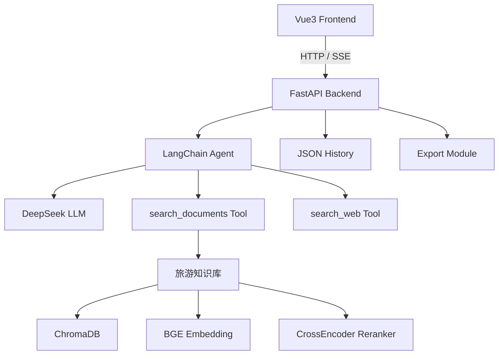
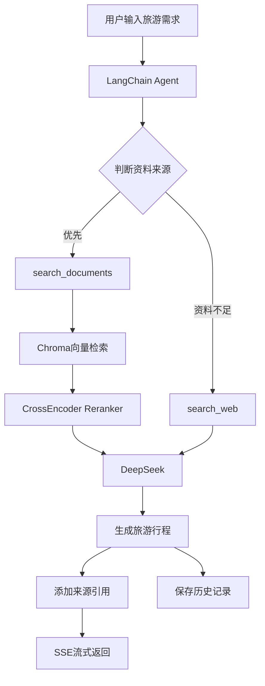

# TripPlanner-AI

基于 **LangChain Agent + RAG + DeepSeek** 的智能旅游行程规划系统。


> TripPlanner-AI 是一个基于 **RAG 检索增强生成、LangChain Agent 和 DeepSeek 大语言模型** 的智能旅游行程规划系统。
>
> 用户上传目的地旅游资料，并输入游玩天数、兴趣偏好和行程节奏，Agent 会自主调用旅游知识库工具检索相关资料，结合用户需求生成结构化旅游行程，并通过 SSE 实现实时流式输出。


---

# 🌟 项目介绍

TripPlanner-AI 面向个性化旅游规划场景，结合：

- RAG 检索增强生成
- LangChain Agent
- Tool Calling
- DeepSeek 大语言模型
- SSE 流式通信


实现从：

```
旅游资料上传
        ↓
知识库构建
        ↓
用户需求分析
        ↓
Agent自主调用工具
        ↓
旅游资料检索
        ↓
AI生成行程
        ↓
历史保存与导出
```

的完整流程。


系统支持上传：

- PDF
- Word
- TXT


旅游资料经过：

```
文档解析
    ↓
文本分片
    ↓
Embedding向量化
    ↓
ChromaDB存储
    ↓
语义检索
    ↓
Reranker排序
```

构建本地旅游知识库。


用户生成行程时，Agent 会优先调用本地知识库获取旅游资料。

如果知识库无法满足需求，则可以调用互联网搜索 Tool 进行补充。


同时系统保留：

- 文件名
- 页码
- 文档来源


等 Metadata，实现生成内容来源追踪，减少大模型旅游规划中的信息幻觉。


---

# 🌟 项目亮点


- 基于 **LangChain Agent Tool Calling** 实现智能旅游规划，根据用户需求自主调用工具
- 基于 **RAG 架构** 构建本地旅游知识库，实现旅游资料解析、分片、向量化和检索
- 使用 **BGE Embedding + ChromaDB** 完成本地旅游资料语义检索
- 引入 **CrossEncoder Reranker** 对向量召回结果进行二次语义排序，提高上下文相关性
- 文档解析过程中保留文件名、页码等 Metadata，实现旅游信息来源引用
- 通过 Prompt 约束 Agent 基于检索资料生成行程，降低虚构景点、路线等问题
- 支持知识库不足时调用互联网搜索 Tool 补充信息
- 基于 SSE 实现 Agent 状态和行程内容实时流式返回
-  使用 **Vue3 + Vue Router + Vite** 构建前端，通过页面组件实现首页、行程规划、知识库、历史记录和项目介绍等功能 
- 使用 **FastAPI** 提供后端 API，并通过 SSE 实现行程生成过程的实时流式通信
- 支持历史旅游行程保存以及 Markdown / Word / Excel 导出


---

# ✨ 功能特性


## 🤖 Agent 智能行程规划


用户输入：

```text
目的地：上海

游玩天数：3天

兴趣偏好：
历史文化
城市观光
美食

行程节奏：
适中
```


Agent 根据用户需求：

```
用户需求
    ↓
LangChain Agent
    ↓
判断信息来源
    ↓
调用旅游工具
    ↓
获取资料
    ↓
DeepSeek生成
    ↓
输出旅游行程
```


最终生成：

- 每日行程安排
- 景点推荐
- 游玩顺序
- 路线建议
- 注意事项
- 资料来源引用


---

# 📚 RAG 旅游知识库


系统支持上传：


```
PDF
Word
TXT
```


上传资料后自动完成：


```
旅游资料
    ↓
文档解析
    ↓
文本分片
    ↓
BGE Embedding
    ↓
ChromaDB
    ↓
向量检索
    ↓
Agent生成
```


文档处理过程中保留：

```
{
    文件名,
    页码,
    文档内容
}
```


用于生成结果引用。


---

# 🔍 Reranker 重排序


为了提高检索准确率，系统在向量召回后增加 CrossEncoder Reranker。


流程：


```
用户问题
    ↓
Embedding
    ↓
ChromaDB
    ↓
Top-K召回
    ↓
CrossEncoder Reranker
    ↓
Top-N高相关资料
    ↓
Agent
```


通过：

```
向量检索
+
语义重排序
```

提高最终提供给 LLM 的上下文质量。


---

# 🔧 Agent Tools


当前 Agent 支持：


## search_documents


本地知识库检索工具。


用于：

- 查询景点信息
- 查询旅游路线
- 查询交通建议
- 查询美食资料
- 查询游玩建议


优先级最高。


---

## search_web


互联网搜索工具。


用于：

- 知识库缺失信息补充
- 查询部分实时变化信息


Agent 会：

```
优先知识库
↓
资料不足
↓
调用网络搜索
```


避免无必要联网。


---

## search_xhs


计划功能。


未来用于：

- 获取小红书旅游攻略
- 获取用户体验信息
- 丰富旅游推荐内容


---

# 📖 资料引用


生成旅游行程时：

景点、路线、交通等具体信息会尽量保留来源。


示例：

```
外滩位于上海黄浦江畔，是上海代表性城市景观。

[来源: 上海旅游资料.pdf-第2页]
```


如果当前资料无法确认：


```
根据当前资料无法确认。
```


系统不会主动编造：

- 景点
- 门票
- 距离
- 时间
- 价格


等信息。


---

# ⚡ SSE 流式输出


后端使用：

```
Server-Sent Events(SSE)
```


实时推送 Agent 执行状态。


流程：

```
开始分析需求
        ↓
调用旅游工具
        ↓
生成旅游方案
        ↓
保存历史记录
        ↓
完成
```


前端实时渲染 Markdown 行程内容。


---

# 🏗️ 系统架构





---

# 🧠 Agent 工作流程





---

# 🛠️ 技术栈


| 模块         | 技术                          |
| ------------ | ----------------------------- |
| Agent框架    | LangChain Agent               |
| 后端         | FastAPI + Uvicorn             |
| LLM          | DeepSeek Chat API             |
| RAG框架      | LangChain                     |
| 向量数据库   | ChromaDB                      |
| Embedding    | BAAI/bge-small-zh-v1.5        |
| Reranker     | BAAI/bge-reranker-base        |
| 文档解析     | PyPDF / Docx2txt / TextLoader |
| 前端         | Vue3 + Vite                   |
| Markdown渲染 | Marked                        |
| 流式通信     | SSE                           |
| 历史记录     | JSON                          |
| 文件导出     | python-docx + openpyxl        |

-----

# 📂 项目结构

```text
TripPlanner-AI/
│
├── backend/
│   │
│   ├── app/
│   │   │
│   │   ├── agent/                       # Agent核心逻辑
│   │   │   ├── agent.py                 # LangChain Agent初始化
│   │   │   └── prompts.py               # Agent系统Prompt
│   │   │
│   │   ├── api/                         # FastAPI接口
│   │   │   ├── trip.py                  # 行程生成接口
│   │   │   ├── knowledge.py             # 知识库管理接口
│   │   │   ├── history.py               # 历史行程接口
│   │   │   └── export.py                # 行程导出接口
│   │   │
│   │   ├── config/                      # 项目配置
│   │   │   └── settings.py              # 环境变量与路径配置
│   │   │
│   │   ├── llm/                         # 大语言模型
│   │   │   └── deepseek.py              # DeepSeek API封装
│   │   │
│   │   ├── rag/                         # RAG核心逻辑
│   │   │   └── rag.py                   # 文档处理、向量检索、Rerank
│   │   │
│   │   ├── tools/                       # Agent工具
│   │   │   ├── rag_tool.py              # 本地知识库检索Tool
│   │   │   └── search_web.py            # 互联网搜索Tool
│   │   │
│   │   ├── storage/                     # 数据存储
│   │   │   └── trip_storage.py          # 历史行程JSON存储
│   │   │
│   │   ├── export/                      # 行程导出
│   │   │   └── exporter.py               # Markdown/Word/Excel导出
│   │   │
│   │   └── main.py                      # FastAPI应用入口
│   │
│   └── data/
│       ├── documents/                   # 上传的旅游资料
│       ├── vector_db/                   # Chroma向量数据库
│       ├── trips/                       # 历史旅游行程
│       └── exports/                     # 行程导出文件
│
│
├── frontend/
│   │
│   ├── public/                          # 静态资源
│   │
│   ├── src/
│   │   │
│   │   ├── assets/                      # 前端资源
│   │   │
│   │   ├── components/                 # 公共组件
│   │   │   └── Navbar.vue              # 顶部导航栏
│   │   │
│   │   ├── router/                     # Vue Router
│   │   │   └── index.js                # 路由配置
│   │   │
│   │   ├── views/                      # 页面视图
│   │   │   ├── Home.vue                # 首页
│   │   │   ├── Planner.vue             # 行程规划页面
│   │   │   ├── Knowledge.vue           # 知识库管理页面
│   │   │   ├── History.vue             # 历史行程页面
│   │   │   └── About.vue               # 项目介绍页面
│   │   │
│   │   ├── App.vue                     # Vue根组件
│   │   ├── main.js                     # 前端入口
│   │   └── style.css                   # 全局样式
│   │
│   ├── package.json                    # 前端依赖
│   ├── vite.config.js                  # Vite配置
│   └── .gitignore
│
│
├── docs/
│   ├── 项目中期说明.md
│   ├── API接口文档.md
│   └── 系统运行截图.md
│
│
├── pyproject.toml                      # Python项目配置
├── uv.lock                             # Python依赖锁定
├── .env.example                        # 环境变量模板
├── .gitignore
└── README.md
```

---

# 🚀 快速开始


## 环境要求


```text
Python >= 3.11

Node.js >= 18

npm

uv

DeepSeek API Key
```


---

# 1. 克隆项目


```bash
git clone https://github.com/rannn-1127/TripPlanner-AI.git


cd TripPlanner-AI
```


---

# 2. 安装后端依赖


项目使用 uv 管理 Python 环境。


```bash
uv sync
```


依赖记录：

```text
pyproject.toml

uv.lock
```


---

# 3. 配置环境变量


复制：


```text
.env.example

↓

.env
```


修改：


```env
DEEPSEEK_API_KEY=your_api_key

MODEL_NAME=deepseek-chat
```


---

# 4. 安装前端依赖


进入前端目录：

```bash
cd frontend

npm install
```


---

# 🗄️ 数据存储说明


本项目不依赖 MySQL。


数据存储：


| 数据     | 存储方式 | 路径                   |
| -------- | -------- | ---------------------- |
| 旅游资料 | 本地文件 | backend/data/documents |
| 向量数据 | ChromaDB | backend/data/vector_db |
| 历史行程 | JSON     | backend/data/trips     |
| 导出文件 | 本地文件 | backend/data/exports   |


---

# ▶️ 启动项目


## 启动后端


```bash
cd backend


uv run uvicorn app.main:app --reload
```


启动：

```text
http://127.0.0.1:8000
```


API文档：

```text
http://127.0.0.1:8000/docs
```


---

## 启动前端


```bash
cd frontend


npm run dev
```


访问：

```text
http://localhost:5173
```


---

# 📖 使用流程


## 1. 上传旅游资料


上传：

```
PDF

Word

TXT
```


系统自动完成：

```
资料上传

↓

文档解析

↓

文本分片

↓

Embedding

↓

ChromaDB
```


---

## 2. 输入旅游需求


示例：


```text
目的地：上海

游玩天数：3天

兴趣偏好：

历史文化

城市观光

美食


行程节奏：

适中

```


---

## 3. Agent生成行程


执行流程：


```
用户需求

↓

Agent分析

↓

调用Tool

↓

RAG检索

↓

Rerank

↓

DeepSeek生成

↓

SSE返回

```


---

# 🕘 历史行程


每次生成成功后保存：


```text
Trip ID

目的地

游玩天数

兴趣偏好

行程节奏

生成内容

创建时间
```


支持：

- 查看历史列表
- 查看历史详情


---

# 📤 行程导出


支持：

```
Markdown

Word

Excel
```


流程：


```
生成行程

↓

保存记录

↓

获取Trip ID

↓

选择格式

↓

导出文件

```


---

# ⚠️ 注意事项


- 本项目当前处于持续优化阶段

- 旅游资料主要来源于用户上传知识库

- Agent优先使用本地资料生成行程

- 无法确认的信息会提示用户

- 不会主动编造景点、价格、距离等信息

- 首次运行需要下载 Embedding 和 Reranker 模型

- 不建议提交真实 `.env` 文件


---

# 📌 后续优化方向


## 🌐 信息增强


- [ ] 优化互联网搜索 Tool

- [ ] 增加小红书旅游攻略获取

- [ ] 增加天气信息 Tool

- [ ] 接入更多旅游数据来源


## 📚 RAG优化


- [ ] 优化文档分片策略

- [ ] 优化检索参数

- [ ] 提升引用准确率

- [ ] 增加知识库管理页面


## 🗺️ 行程规划优化


- [ ] 优化旅游规划 Prompt

- [ ] 增加路线优化

- [ ] 增加预算规划

- [ ] 增加行程冲突检测


## 📊 系统评估


- [ ] 构建15组旅游测试案例

- [ ] 统计行程完整率

- [ ] 统计引用命中率

- [ ] 对比不同RAG参数效果


## 🚀 工程优化


- [ ] Docker部署

- [ ] 用户认证

- [ ] 数据库持久化

- [ ] API限流

- [ ] 服务部署


---

# License

MIT License